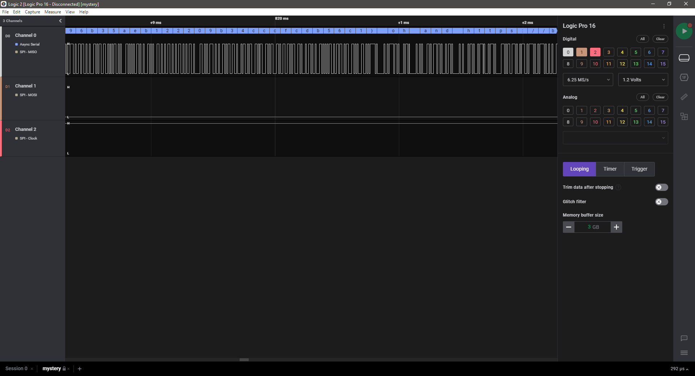
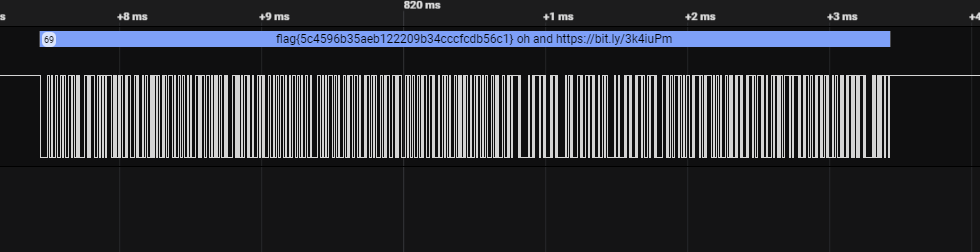

# Cereal (Hardware)
## Challenge
```
"Oh no I dropped my cereal!!" 
```

Files:
* [mystery.sal](mystery.sal)

## Solution

First we have to find out, what a .sal File actually is.
Running `file mystery.sal` states that the file is a Zip archive.

I unzipped the file using 7zip and had a look into to resulting folder.
Running `file` on the .bin files did not provide any information.

Running `strings` on them to see potential text in the files shows a block in the beginning: `<SALEAE>`

A Google Search later I found out, that this kind of files can be opened using a tool names `Logic 2`
https://discuss.saleae.com/t/utilities-for-sal-files/725

Installing the tool and opening the file seems to show a digital signal in channel 0
 

Scrolling out reveleals the flag


Flag:  `flag{5c4596b35aeb122209b34cccfcdb56c1}`