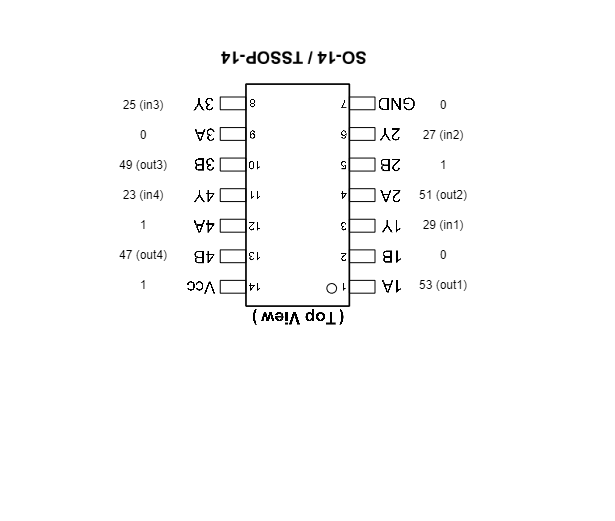

# Dreeno

## Challenge

``
We found this wack program running on an Arduino Mega using some spider-looking thing on a breadboard. The information we need is redacted in the program we found, but we managed to grab the serial output from the program. Help us figure out what this information is! 
``

Files:  
* [setup.jpg](setup.jpg)
* [sketch.pdf](sketch.pdf)
* [source.ino](source.ino)
* [output.txt](output.txt)

## Solution

having a look at the picture `setup.jpg` we see, that the logic chip is a 74HC86 chip  
Pulling up the data sheet from https://www.diodes.com/assets/Datasheets/74HC86.pdf  reveals this is an XOR-Gate

As per the wiring from `sketch.pdf` we can get following mapping (the chip is mounted head down from our pount of few)  

Resulting in following input-output mapping

in1 = out1 XOR 0 ⇒ in1 ≡ out1  
in2 = out2 XOR 1 ⇒ in2 ≡ ¬out2  
in3 = out3 XOR 0 ⇒ in3 ≡ out3  
in4 = out4 XOR 1 ⇒ in4 ≡ ¬out4  

Let's check if this checks out:  

f = 0110 0110 results in 0011 0011  
l = 0110 1100 results in 0011 1001  
a = 0110 0001 results in 0011 0100  
g = 0110 0111 results in 0011 0010  

Comparing this to `output.txt` this seems to match.

This mapping is reversable, so we do not need to recaalculate any new rules.
To map from the provided `output.txt` to the flag we can run script `decode.py` to get the flag

Flag: flag{a16b8027cf374b115f7c3e2f622d84bc}

