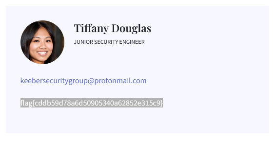
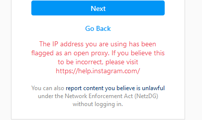

# Keeber (Challange Group OSINT)

## Keeber 1
### Challenge
``` 
You have been applying to entry-level cybersecurity jobs focused on reconnaissance and open source intelligence (OSINT). Great news! You got an interview with a small cybersecurity company; the Keeber Security Group. Before interviewing, they want to test your skills through a series of challenges oriented around investigating the Keeber Security Group.

The first step in your investigation is to find more information about the company itself. All we know is that the company is named Keeber Security Group and they are a cybersecurity startup. To start, help us find the person who registered their domain. The flag is in regular format. 
```

### Solution

Googleing for `Keeber Security Group` does give us the website:  
`https://keebersecuritygroup.com`

Running the side against a Whois-Service reveals the flag
```
Registrant Contact Information:
    Name                flag{ef67b2243b195eba43c7dc797b75d75b} Redacted
    Organization
    Address             8 Apple Lane
    City                Standish
    State / Province    ME
    Postal Code         04084
    Country             US
    Phone               Non-Public Data
    Email

```

## Keeber 2
### Challenge
```
The Keeber Security Group is a new startup in its infant stages. The team is always changing and some people have left the company. The Keeber Security Group has been quick with changing their website to reflect these changes, but there must be some way to find ex-employees. Find an ex-employee through the group's website. The flag is in regular format. 
```

### Solution

The Challenge states that the employees are listed on tne website (`https://keebersecuritygroup.com/team/`)
Running the website through webarchive shows, that there are some versions from Apr. 19th including a picture of employee Tiffany Douglas



## Keeber 3
### Challenge
```
The ex-employee you found was fired for "committing a secret to public github repositories". Find the committed secret, and use that to find confidential company information. The flag is in regular format. 
```

### Solution

The secret needs to be searched on in github.
Looking for keebersecurity (same as the mail-adresses) we find an organization with 3 repositories
https://github.com/keebersecuritygroup

The malicious commit is located in the repository  
https://github.com/keebersecuritygroup/security-evaluation-workflow  
within commit   
https://github.com/keebersecuritygroup/security-evaluation-workflow/commit/e76da63337cfabb12ea127af3f86168e9dd08428

Trying this out at https://app.asana.com/-/login results in a failed login attempt.  
The secret looks suspiciously like an API Key or some sorts.
Diving deeper into the Documentation for Asana we can find an article for personal access Tokens  
https://developers.asana.com/docs/personal-access-token  
with a link to the Authentication Quick Start Guide that shows the syntax of a PAT  
https://developers.asana.com/docs/authentication-quick-start

```
0/68a9e79b868c6789e79a124c30b0
```

Knowing the Syntax is correct we can try to access an easy target service such as reading out the users list
```
curl 'https://app.asana.com/api/1.0/users' \
--header 'Authorization: Bearer 1/1202152286661684:f136d320deefe730f6c71a91b2e4f7b1'
```

We will get an answer meaning we are authenticated \o/
```
{"data":[{"gid":"1202175428051397","name":"Kate","resource_type":"user"},{"gid":"1202191206433936","na,"name":"´pepe lotas","resource_type":"user"},{"gid":"1202193137468108","name":"Andrew Parchenok","reselly","resource_type":"user"},{"gid":"1202202298883155","name":"keeber-rachel@protonmail.com","resourcez Lopez","resource_type":"user"},{"gid":"1202203522711378","name":"ldfkhgkjdfh[...]
```

Checking this payload we will find the flag on gid 1202152286661684

```
        {
            "gid": "1202152286661684",
            "name": "flag{49305a2a9dcc503cb2b1fdeef8a7ac04}",
            "resource_type": "user"
        },
```

## Keeber 5
### Challenge
```
The ex-employee in focus made other mistakes while using the company's GitHub. All employees were supposed to commit code using the keeber-@protonmail.com email assigned to them. They made some commits without following this practice. Find the personal email of this employee through GitHub. The flag is in regular format. 
```

### Solution

clone git repository into own workspace
```
$ git clone https://github.com/keebersecuritygroup/security-evaluation-workflow.git
$ cd security-evaluation-workflow
```

and have a look into the git log
```
git log
```

When scrolling down we can find the private mail address of Tiffany including the flag
```
commit b25ed7f5aa72f88c0145a3832012546360c2ffc2
Author: flag{2c90416c24a91a9e1eb18168697e8ff5} <tif.hearts.science@gmail.com>
Date:   Wed Apr 20 22:46:09 2022 -0400

    started code_reviews.txt
```

## Keeber 6
### Challenge
```
After all of the damage the ex-employee's mistakes caused to the company, the Keeber Security Group is suing them for negligence! In order to file a proper lawsuit, we need to know where they are so someone can go and serve them. Can you find the ex-employee’s new workplace? The flag is in regular format, and can be found in a recent yelp review of their new workplace.

(Hint: You will need to pivot off of the email found in the past challenge!) 
```

### Solution

Following a [writeup](https://github.com/W3rni0/NahamCon_CTF_2020#finsta) from 2 years ago we can find a tool to search for account in socials.

Running this with the newfound name `tif.hearts.science`we get a bunch of potential social media profiles:
```
$ python3 sherlock.py tif.hearts.science
[*] Checking username tif.hearts.science on:


[+] Countable: https://www.countable.us/tif.hearts.science
[+] EyeEm: https://www.eyeem.com/u/tif.hearts.science
[+] FanCentro: https://fancentro.com/tif.hearts.science
[+] G2G: https://www.g2g.com/tif.hearts.science
[+] Gab: https://gab.com/tif.hearts.science
[+] HackerRank: https://hackerrank.com/tif.hearts.science
[+] Instagram: https://www.instagram.com/tif.hearts.science
[+] Pinkbike: https://www.pinkbike.com/u/tif.hearts.science/
[+] Raidforums: https://raidforums.com/User-tif.hearts.science
[+] Snapchat: https://www.snapchat.com/add/tif.hearts.science
[+] Spotify: https://open.spotify.com/user/tif.hearts.science
[+] Strava: https://www.strava.com/athletes/tif.hearts.science
[+] Venmo: https://venmo.com/u/tif.hearts.science
[+] eBay.com: https://www.ebay.com/usr/tif.hearts.science
[+] eBay.de: https://www.ebay.de/usr/tif.hearts.science


[!] End:  The processing has been finished.
```

The only account that we can reliably connect to Tiffany is the instagram account
https://www.instagram.com/tif.hearts.science

#### During this endevour my IP was blocked by Instagram on sussicion of being an open proxy


Checking Tiffanys Instagram account reveals that she is now working in a hotel of some sort) and has a commute of around 20min by foot and ferry into the city.

Knowning her former employer was located in `Standish, Maine` we can have a look around, where ferries could potentially be operated.
Near Standish we find the city of `Portland, Maine` and can have a look into the hotels near the waterside.

**After Challenge - Solve**  
The hotel in question is the [Residence Inn by Marriott Portland Downtown/Waterfront](https://www.yelp.com/biz/residence-inn-by-marriott-portland-downtown-waterfront-portland) wich has a comment stating 
```
Portland is such a great city with a hometown feel to it. Behind the scenes, there is a lot of attention to detail put into ensuring the best guest experiences. Rooms are cleaned thoroughly between stays, and covid protocol is followed well. This is a hotel I would want to stay at while traveling.

P.S. flag{0d70179f4c993c5eb3ba9becfb046034}
```

I wasn't able to find this one, because my yelp defaulted to yelp.de. which does not have the necessary comment present. 😡 ([see here](https://www.yelp.de/biz/residence-inn-by-marriott-portland-downtown-waterfront-portland))


...

## Keeber 7
### Challenge
```
Multiple employees have gotten strange phishing emails from the same phishing scheme. Use the email corresponding to the phishing email to find the true identity of the scammer. The flag is in regular format.

(Note: This challenge can be solved without paying for anything!) 
```
Files: [keeber_7.pdf](keeber_7.pdf)
### Solution
