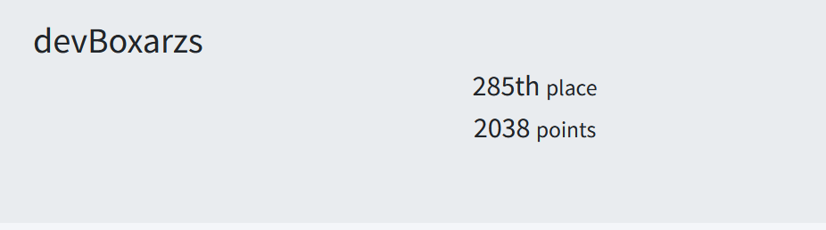
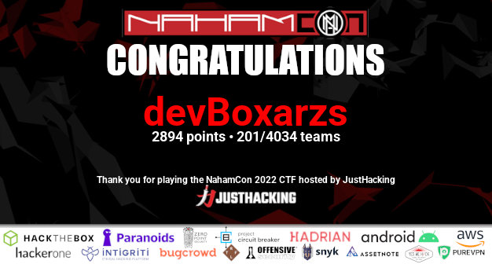

# Solution to challenges

## Warmups
### [Quirky](quirky/README.md)
### [Flagcat](flagcat/README.md)
### [Prisoner](prisoner//README.md)
### [Exit Vim](#)
### [Crash Override](crash-override/README.md)
### [Read The Rules](rules-page/README.md)
### [Wizard](wizard/solution.txt)
### [Technical Support](#)

---
## Web
### [Personell](personnel/README.md)
### [EXtravagant](EXtravagant/README.md)
### [Jurassic Park](Jurassic_Park/README.md)

---
## Crypto
### [Unimod](UniMod/README.md)

---
## DevOps
### [Poisoned](Poisoned/README.md)

---
## Hardware/RF
### [Dweeno](Dreeno/README.md)
### [Cereal](Cereal/README.md)

---
## Misc
### [WhenAmI](WhenAmI/README.md)
### [One Matissa Please](OneMantissePlease/README.md#one-mantissa-please)
### [To Be or Not to Be](OneMantissePlease/README.md#to-be-or-not-to-be)
### [Steam Locomotive](SteamLocomotive/README.md)
### [The Balloon](balloon/balloon.txt)

---
## OSINT Keeber
### [Keeber 1](Keeber/README.md#keeber-1)
### [Keeber 2](Keeber/README.md#keeber-2)
### [Keeber 3](Keeber/README.md#keeber-3)
### Keeber 4 (not solved)
### [Keeber 5](Keeber/README.md#keeber-5)
### [Keeber 6](Keeber/README.md#keeber-6)
### Keeber 7 (not solved)
### Keeber 8 (not solved)

---

# Timeline

## Day 1 - Thursday evening / night
Starting strong in the first 3-4 hours.

337th Place out of 1447 Teams. Doing good.  

## Day 2 - Friday
Still holding strong, and Tnumber of teams is growing to nearly 3000.  
Maybe top 10% is doable? 😅  

## Day 3 - Saturday Final Day
got the certificate at the End of the Day.  
**Top 5% Babeyyy**  
